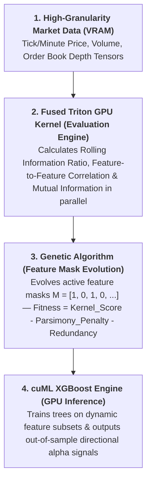

# Genetic Algorithim Alpha Generation + XGBoost

## Executive Summary & Core Hypothesis
Financial markets exhibit extreme non-stationarity; static feature sets become stale 
as market regimes shift (e.g., high volatility vs. low volatility). Traditional ML 
models like XGBoost overfit when trained on fixed, legacy features.

This project introduces an **Adaptive GPU-Native Alpha Factory**:
- A **Genetic Algorithm (GA)** dynamically evolves a binary feature mask vector across rolling time windows.
- A **Custom Fused Triton Kernel** accelerates the feature evaluation step by computing rolling signal metrics, cross-correlations, and mutual information directly in GPU VRAM.
- A **cuML XGBoost Engine** receives the optimal, non-redundant feature subset to generate real-time return predictions with zero CPU host-memory transfer overhead.

## 2. System Architecture & Dataflow

## 3. Module Breakdown

### A. The Fused Triton Kernel
- **Role:** Eliminates memory bandwidth bottlenecks by fusing rolling statistics into a single CUDA execution pass.
- **Key Operations:**
  - Parallel rolling window calculation across $N$ assets and $F$ candidate features.
  - Pairwise covariance and feature correlation matrix construction.
  - Output: Instantaneous fitness scores for candidate feature masks without writing intermediate arrays back to global memory.

### B. Genetic Algorithm Masking Engine
- **Role:** Operates on a binary mask $M \in \{0, 1\}^F$ representing active features.
- **Operators:**
  - **Selection:** Tournament selection based on custom fitness outputs.
  - **Crossover:** Uniform crossover swapping feature bitmasks.
  - **Mutation:** Low-probability bit flips ($1\% \text{--} 5\%$) to explore unmapped signal spaces.
- **Fitness Score Design:**
  $$\text{Fitness} = \text{Signal\_Quality}(M) - \lambda_1 (\text{Active\_Feature\_Count}) - \lambda_2 (\text{Redundancy\_Score})$$

### C. GPU XGBoost & Backtest Engine
- **Role:** Takes the top $K$ features selected by the GA for the current window and fits gradient boosted decision trees using `cuML`.
- **Validation Strategy:** Purged Walk-Forward Cross-Validation to eliminate data snooping/lookahead bias.
- **Execution Cost:** Integrates explicit transaction cost/slippage subtractions ($2\text{--}5 \text{ bps}$) into backtested Sharpe evaluations.
