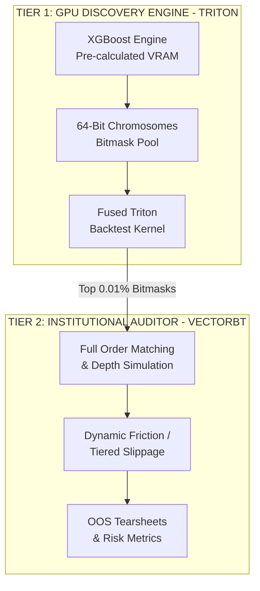
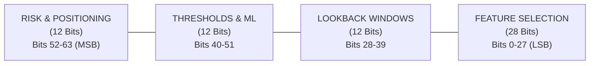

# High-Performance Alpha Discovery via Fused Triton GPU Kernels and Island Model Genetic Algorithms

**System Architecture Specification and Research Roadmap**

## Abstract

This document outlines the technical design, mathematical foundation, and validation methodology for a high-throughput quantitative strategy discovery engine. The architecture decouples hypothesis search from execution auditing by employing a two-tier framework:
1. **Tier 1 (GPU Proxy):** A fused custom Triton GPU kernel evaluating millions of candidate strategies per second using a compact 64-bit chromosomal bitmask layout and an SRAM-bound backtesting loop.
2. **Tier 2 (CPU Gold Standard):** Institutional-grade auditing via `vectorbt` to eliminate GPU thread-divergence overhead while maintaining exact simulation fidelity (slippage, order book depth, dynamic fees) on the top $0.01\%$ surviving candidates.

Machine learning features are pre-computed using XGBoost to capture microeconomic non-linearities and threshold effects. Strategy discovery across $8\times$ NVIDIA GPUs is managed via a distributed Island Model Genetic Algorithm (GA) with Purged Walk-Forward Cross-Validation (PWFCV) and Deflated Sharpe Ratio (DSR) fitness scoring to prevent overfitting and $p$-hacking.

## 1. System Architecture & Two-Tier Execution Model

High-throughput strategy search requires balancing evaluation speed against market simulation accuracy. Implementing full order-book dynamics inside a GPU kernel causes severe thread divergence, stalling warp execution. To solve this, the architecture splits processing into a high-speed search tier and a high-fidelity audit tier.



| Attribute | Tier 1: Triton GPU Proxy | Tier 2: `vectorbt` CPU Auditor |
| :--- | :--- | :--- |
| **Primary Goal** | Ultra-fast search space pruning | Final verification & institutional reporting |
| **Execution Domain** | GPU Registers / SRAM | CPU / Numba Memory |
| **Throughput** | $>10^6$ strategy evaluations / sec | $10^2 - 10^3$ strategy evaluations / sec |
| **Execution Pricing** | Next-bar close / open approximation | Exact limit, stop, and market order execution |
| **Market Friction** | Fixed basis-point ($X$ bps) penalty | Dynamic volume-weighted impact & exchange tiers |
| **Output** | Scalar fitness (Deflated Sharpe) | Full trade logs, drawdowns, and tearsheets |

## 2. Chromosome Specification (64-Bit Strategy Bitmask)

Every trading strategy is encoded as a single contiguous `uint64_t` bitmask. This allows an entire strategy definition to fit inside a **single GPU thread register**, eliminating High Bandwidth Memory (HBM) allocations during kernel evaluation. 



### Bit Allocation Schema

1. **Feature Selection Flags (Bits 0–27):** 28 boolean flags ($1 = \text{ON}, 0 = \text{OFF}$) mapping to pre-computed structural features (e.g., Order Flow Imbalance, VPIN, XGBoost Leaf outputs).
2. **Lookback Window Parameters (Bits 28–39):** Encoded as **Gray Code**. Gray coding ensures that adjacent integer values differ by exactly one bit, creating a smoother mutation landscape for the GA.
3. **Signal Thresholds & Model Hyperparameters (Bits 40–51):** Defines the standard deviation ($Z$-score) entry/exit bounds.
4. **Risk Management & Execution Rules (Bits 52–63):** Parameterizes the dynamic Stop-Loss multiple (e.g., $0.5\times$ to $4.0\times$ ATR), Take-Profit constraints, and position sizing formulas.

## 3. Fused Triton GPU Kernel Design

Writing standard CUDA or PyTorch operations often results in chained kernels that write intermediate states back to HBM, creating a massive memory bandwidth bottleneck. By writing a **Fused Triton Kernel**, operations are loaded once into L1/L2 cache and L0 SRAM, allowing element-wise operations and reductions to occur directly in registers. 

### Grid Mapping and Execution Model

Instead of parallelizing across timestamps, which destroys temporal state dependence, the kernel maps **1 GPU Program Instance (CUDA Block) = 1 Strategy Bitmask**.

```python
import triton
import triton.language as tl

@triton.jit
def fused_backtest_kernel(
    bitmask_ptr,       # [N] uint64 candidates
    features_ptr,      # [T, F] pre-computed XGBoost & Market features
    sharpe_out_ptr,    # [N] float32 fitness outputs
    T_TIMESTAMPS: tl.constexpr,
    BLOCK_SIZE: tl.constexpr = 1024
):
    pid = tl.program_id(0)
    chromosome = tl.load(bitmask_ptr + pid)
    
    # Unpack chromosome in registers
    feature_mask = chromosome & 0x0FFFFFFF
    z_threshold  = 1.0 + ((chromosome >> 40) & 0x0F) * 0.15
    
    # State accumulators in SRAM (Zero HBM writes during loop)
    cum_return = 0.0
    variance_acc = 0.0
    position = 0.0

    # Sequential chunking over time ensures temporal dependence
    for t_offset in range(0, T_TIMESTAMPS, BLOCK_SIZE):
        cols = t_offset + tl.arange(0, BLOCK_SIZE)
        # Load feature tile -> compute signal -> update position & return
        # ... [Predicated signal logic] ...
        
    final_sharpe = cum_return / (tl.sqrt(variance_acc) + 1e-6)
    tl.store(sharpe_out_ptr + pid, final_sharpe)
```

This fused approach eliminates millions of intermediate HBM writes, rendering the pipeline entirely compute-bound and accelerating evaluation speeds by orders of magnitude.

## 4. XGBoost Integration and Microeconomic Rationale

Instead of attempting to train gradient boosted trees inside the Triton GA loop—which introduces catastrophic warp divergence—XGBoost is utilized as a **Tier 0 Pre-computation Engine**. 

XGBoost is uniquely suited for tabular market data because it partitions continuous feature spaces into non-linear step functions, capturing market liquidity exhaustion and regime shifts. By providing custom objective functions, XGBoost learns via both the **gradient** (the direction of the error) and the **Hessian** (the curvature or confidence of the error landscape). This means the step size automatically adjusts in volatile or flat market regimes.

**Integration Strategy:**
1. Train an XGBoost ensemble offline utilizing a custom loss objective (e.g., asymmetric log-loss penalizing false positives in high-spread regimes).
2. Extract the continuous leaf-node outputs (or SHAP values).
3. Push these outputs into the VRAM `features_ptr` matrix. 
4. The GA then mutates the weights and interaction thresholds of these XGBoost signals against standard microstructural features inside the Triton Kernel.

## 5. Distributed Co-Evolution (Island Model GA)

To maximize the compute of an $8\times$ GPU cluster, the algorithm deploys an **Island Model** architecture via `torch.distributed` (DDP). 

*   **Isolation:** Each of the 8 GPUs holds an independent population of $10,000$ candidate strategies, initialized with unique hyperparameter distributions or targeting distinct market regimes (e.g., GPU 0 optimizes for trend-following, GPU 1 for mean-reversion).
*   **Migration Phase:** Every $N$ generations, a synchronization hook executes. The top $1\%$ "elite" bitmasks from each GPU are copied across the DDP process group to neighboring islands.
*   **Genetic Diversity:** This preserves unique evolutionary lineages and prevents premature convergence into local optima.

## 6. Overfitting Prevention and Validation 

An unconstrained GA capable of billions of evaluations will mathematically guarantee a spurious, overfitted result if evaluated on a static block of time. The architecture prevents $p$-hacking through three strict constraints:

1.  **In-Kernel Purged Walk-Forward Cross Validation (PWFCV):** The Triton kernel does not evaluate fitness on one continuous block. It evaluates on rolling non-contiguous chunks, explicitly purging (removing) the data separating the train and out-of-sample (OOS) sets to prevent autocorrelation leakage.
2.  **Sparsity Penalization:** The fitness function subtracts a penalty proportional to the number of active bits (using a `popcount` intrinsic). Given two strategies with equal returns, the algorithm aggressively favors the simpler one.
3.  **Deflated Sharpe Ratio (DSR):** Standard Sharpe ratios are statistically biased when testing multiple hypothesis trials. The kernel calculates fitness using the DSR, adjusting the required hurdle rate dynamically based on the variance of the candidate pool and the number of bitmasks evaluated.

### Final Pipeline Handoff
Once the $8\times$ GPU array converges, the top $0.01\%$ bitmasks are extracted, decoded, and fed into the `vectorbt` auditor on CPU. Only strategies that survive the strict execution frictions of Tier 2 and demonstrate OOS robustness are escalated for production deployment.